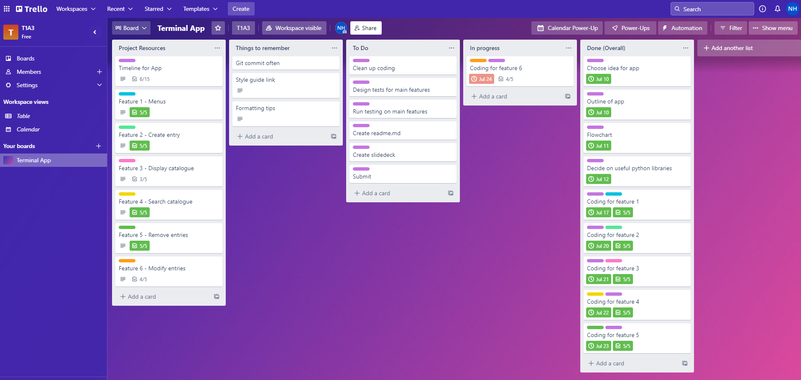
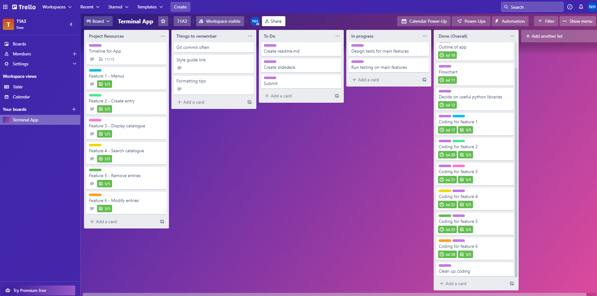
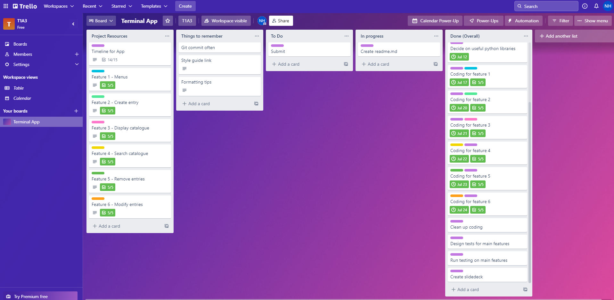

This is where info on how to use this is gonna go.

## Installation
1. You will need python 3.8 or higher. If you don't already have it, you can find that [here](https://www.python.org/).
2. Clone the app to your home directory
```
git clone https://github.com/artemisticc/Terminal-App.git
```
3. Run the bash script to run the program.
```
./run_catalogue.sh
```


## Dependencies
**If** the bash script does not install the necessary modules, follow these instructions to make sure you have everything needed to run the Catalogue program.
1. Ensure you have pip installed.  
You can check if you have pip installed by using
```
pip3 --version
```
If you don't have it installed, install it using:
```
sudo apt update 
sudo apt install python3-pip 
```
2. Then, type (or copy & paste) the following lines into your terminal.

```
pip install simple-term-menu
pip install termcolor
pip install tabulate
pip install art
pip install pandas
pip install colorama
```

## System/Hardware requirements
This program was created to be run on a linux system and, as such, will be best suited to be run on linux.

## User guide/Features:

This application was made with the intention of using it as an inventory handler (or catalogue) for a 
The features of this app include:
1. **Selectable menus** - you can navigate to what you would like to do by using the up & down arrows on your keyboard. Pressing enter confirms your selection. You can exit menus (or the program, if in the main menu) by either pressing escape or selecting Exit.
2. **Display books in catalogue** - selecting the catalogue list displays all the entries within the catalogue in a neat table. An empty table will be displayed if there are no entries.
3. **Search for entry** - selecting to search the catalogue gives you the option to search by Title or Author. You can type in the title or author of an entry and the app will search for it within the catalogue and display any matching results if they are found. Please note: the search function is case sensitive. 
4. **Add books to catalogue** - selecting "Create entry" allows you to add books into the catalogue. You can define how many books you would like to create and then type in the information. The price and the stock count must be numbers, but only the price may include decimal points. Blank entries are not accepted.
5. **Remove books from catalogue** - selecting "Remove entry" displays the catalogue and allows you to remove an entry from the catalogue by typing in its corresponding number. Selecting a number that does not exist will result in an error and the app will ask again. Leaving the entry selection input blank will return you to the main menu.
6. **Modify entries in catalogue** - selecting to modify the entries displays the catalogue and allows you to modify an entry of your choice. After typing in the corresponding number of the entry you would like to modify, you may select what information to edit. These modifcations follow the same rules as creating an entry. Leaving the entry selection input blank will return you to the main menu.

## Implementation plan

I decided to use Trello for keeping track of the development of my app. Due to reasons outlined in my support plan, I was unable to adhere to most deadlines, but my features were still created and implemented according to my plan outline on the project management website.




